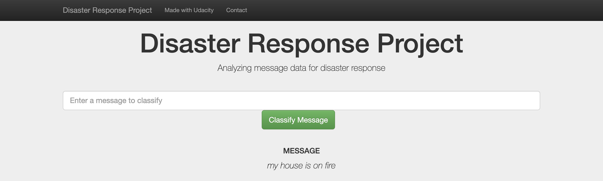

# Disaster Response Pipeline Project




## Table of Contents
1. [Description](#description)
2. [Getting Started](#getting_started)
	1. [Requirements](#requirements)
	2. [Installation](#installation)
	3. [Execution](#execution)
    4. [Important Files](#importantfiles)
	5. [Additional resources](#resources)
3. [Authors](#authors)
4. [Acknowledgement](#acknowledgement)

<a name="descripton"></a>
## Description

The goal of this project is to build a Natural Language Processing (NLP) model that categorizes messages on a real time basis. This Project is part of the Data Science Nanodegree Program by Udacity in collaboration with Figure Eight. The dataset is provided by Figure Eight and contains pre-labelled tweet and messages from real-life disaster events. 

This project has three main sections:

1. Building an ETL pipeline to extract data from source, clean the data and load the data into a SQLite DB
2. Building a machine learning pipeline to train the which can classify text message in various categories
3. Run a web app which can show the model results in real time

<a name="requirements"></a>
### Requirements
* Python 3.5+
* Machine Learning Libraries: NumPy, SciPy, Pandas, Sciki-Learn
* Natural Language Process Libraries: NLTK
* SQLlite Database Libraqries: SQLalchemy
* Model Loading and Saving Library: Pickle
* Web App and Data Visualization: Flask, Plotly

<a name="installation"></a>
### Installing
To clone the git repository:
```
git clone https://github.com/OmoyeniO/Disaster-Response-Pipeline.git
```
<a name="execution"></a>
### Execution:
1. Run the following commands in the project's directory to set up the database, train model and save the model.

    - To run ETL pipeline to clean data and store the processed data in the database
        `python data/process_data.py data/disaster_messages.csv data/disaster_categories.csv data/disaster_response_db.db`
    - To run the ML pipeline that loads data from DB, trains classifier and saves the classifier as a pickle file
        `python models/train_classifier.py data/disaster_response_db.db models/classifier.pkl`

2. Run the following command in the app's directory to run your web app --- Go to `app` directory: `cd app` then
    `python run.py`

3. Go to http://0.0.0.0:3000/

<a name="importantfiles"></a>
### Important Files
**app/templates/***: templates/html files for web app

**data/process_data.py**: Extract Train Load (ETL) pipeline used for data cleaning, feature extraction, and storing data in a SQLite database

**models/train_classifier.py**: A machine learning pipeline that loads data, trains a model, and saves the trained model as a .pkl file for later use

**run.py**: This file can be used to launch the Flask web app used to classify disaster messages


<a name="resources"></a>
### Additional resources

The code contains two jupyter notebooks names *ML pipeline preperation* and *ETL pipeline preperation* that will help in understanding how the model works in detail:

1. **ETL Pipeline Preparation Notebook**: learn everything about the implemented ETL pipeline
2. **ML Pipeline Preparation Notebook**: look at the Machine Learning Pipeline developed with NLTK and Scikit-Learn

You can use **ML Pipeline Preparation Notebook** to re-train the model or tune it through a dedicated Grid Search section.


<a name="authors"></a>
## Authors

* [Omoyeni Ogundipe](https://github.com/OmoyeniO)

<a name="acknowledgement"></a>
## Acknowledgements

* [Udacity](https://www.udacity.com/) for providing an amazing Data Science Nanodegree Program
* [Figure Eight](https://www.figure-eight.com/) for providing the relevant dataset to train the model

